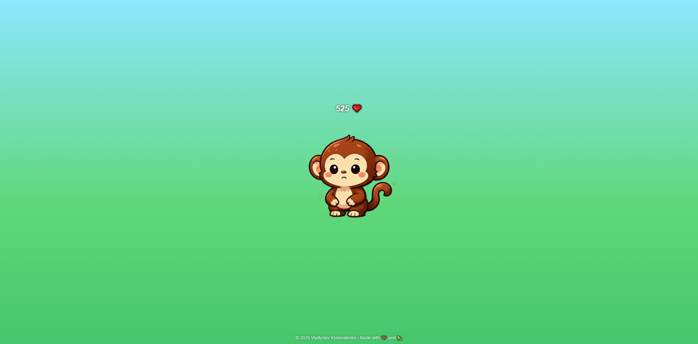

# Pet the Monkey 🐒

## 🇺🇦 Українською

Односторінкова міні-гра, де можна гладити мавпу та збирати ❤️.  
Анімації мавпи, курсор-рука, банани та бонусні серця.

### Фішки

- Дихання та усмішка мавпи
- Курсор-рука для ПК, touch для мобільних пристроїв
- Серця і банани при певній кількості кліків
- Лічильник кліків з локальним збереженням

### Деплой

Гра доступна онлайн: [GitHub Pages](https://vladkonovalenko.github.io/pet-the-monkey)

### Технології

- HTML / CSS / JS
- Анімації через `setInterval` та CSS `@keyframes`
- Адаптивний дизайн для мобільних пристроїв

---

## 🇬🇧 English

Single-page mini-game where you can stroke a monkey and collect ❤️.  
Includes monkey animations, a hand cursor, bananas, and bonus hearts.

### Features

- Breathing and smiling monkey
- Hand cursor for PC, touch interactions for mobile
- Hearts and bananas appear at certain click counts
- Click counter with localStorage

### Deployment

The game is available online: [GitHub Pages](https://vladkonovalenko.github.io/pet-the-monkey)

### Technologies

- HTML / CSS / JS
- Animations via `setInterval` and CSS `@keyframes`
- Responsive design for mobile devices

